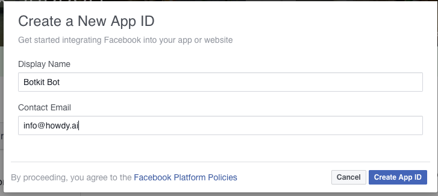
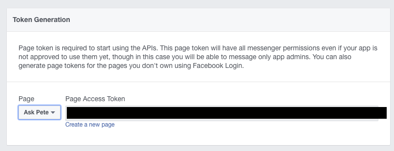
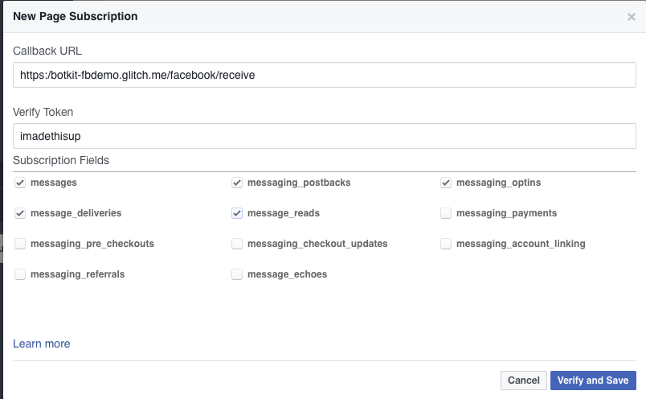

# Configure Botkit and Facebook Messenger

*Note: This also applies for [Facebook Workplace](https://www.facebook.com/workplace)*

Facebook is a constantly evolving platform, nominally you can find everything you [need to create a bot](https://developers.facebook.com/docs/messenger-platform/guides/quick-start) on their platform page, but that information is subject to change.

The easiest path to creating a new bot for Facebook Messenger is through Botkit Studio. [Sign up for an account here](https://studio.botkit.ai/signup/). This method will provide a guided path to hosting, along with other useful tools for creating and managing your bot.

For advanced users looking to run their own code, you will need to [install Botkit](https://github.com/howdyai/botkit-starter-facebook) and run it before your bot can be configured with Messenger.

### 1. [Install Botkit](/docs/core.md#start-with-botkit-studio)

Once installed, you will need to do steps 2-4, and steps 5 in parallel. It helps to have your development enviroment and the Facebook for Developers page open at the same time.

### 2. Create a Facebook App for Web

Visit [Facebook for Developers page](https://developers.facebook.com/tools-and-support/) and create a new app.

* Select a Messenger application

### 3. Get a Page Access Token for your app
Scroll down to `Token Generation`

If you have not yet created your page yet, you can go ahead and do this now, or associate this new bot with an existing page.

Copy this `Page Access Token`, you'll need it when running your bot.

### 4. Setup webhooks
Click  `Setup Webhooks` to link this application to your Botkit instance.

The callback url will be `https://YOURURL/facebook/receive`. This URL must be publically available, and SSL-secured. More information on this can be found in the next step.

You will also need to define a `Verify Token` for your page subscription. This is a user-defined string that you will keep secret and pass in with your environment variables.

### 5. Run your application

Run your application with your environment variables set:

* `page_token` - Your Page Access Token (**required**)
* `verify_token` - Your Verify Token (**required**)
* `studio_token` - Your [Botkit Studio](https://studio.botkit.ai/signup) Token (optional)

If your application has been configured correctly, you will be able to talk to your bot through the page you specified in Step 3. Congratulations!

### Additional resources
*  [Botkit Facebook readme](/docs/readme-facebook.md)
*  [Botkit Facebook Starter Kit](https://github.com/howdyai/botkit-starter-facebook)
*  [Messenger Platform Documentation](https://developers.facebook.com/products/messenger/)
*  [Submit your bot so it can be publically available](https://developers.facebook.com/docs/messenger-platform/submission-process)
*  [Sign up for Botkit Studio](https://studio.botkit.ai/)
